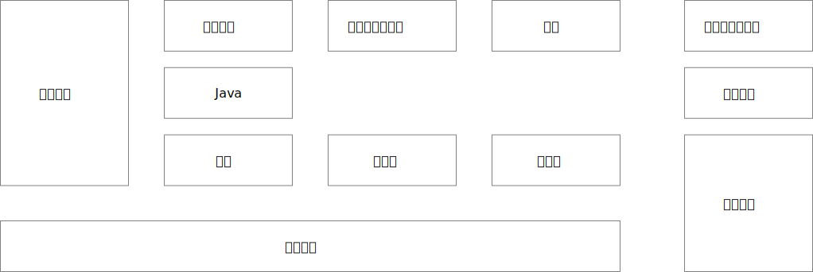

# 学习大纲

# 网络

图解 HTTP
计算机网络谢希仁
计算机网络自顶向下方法
计算机网络特南鲍姆

# 计算机组成原理

计算机组成原理唐朔飞
计算机组成原理艾伦·克莱门次

# 操作系统

深入理解计算机系统
现代操作系统
操作系统概念
操作系统导论

# 设计模式

设计模式可复用面向对象软件的基础  
大话设计模式  
设计模式之禅  
Head First 设计模式（中文版）

# 数据结构和算法

[刷题](https://leetcode.cn/)

漫画算法：小灰的算法之旅
剑指 offer
labuladong的算法小抄
算法导论
《数据结构与算法之美》
《算法面试通关40讲》
# Java

* [Java基础](Java/Java基础.md)
* [[Java/Java集合|Java集合]]
* JavaIO
* Java多线程
* Java虚拟机

# 数据库

- SQL
- 索引
- [事务](数据库/事务.md)
- 锁
- 优化
- [并发控制](数据库/并发控制.md)

# 框架

- Spring Boot
- Spring
- Spring MVC
- Mybatis

# 中间件

- 缓存
- 消息队列
- 搜索引擎

# 系统设计

- 集群
- 分布式

# 开发工具

# 部署工具